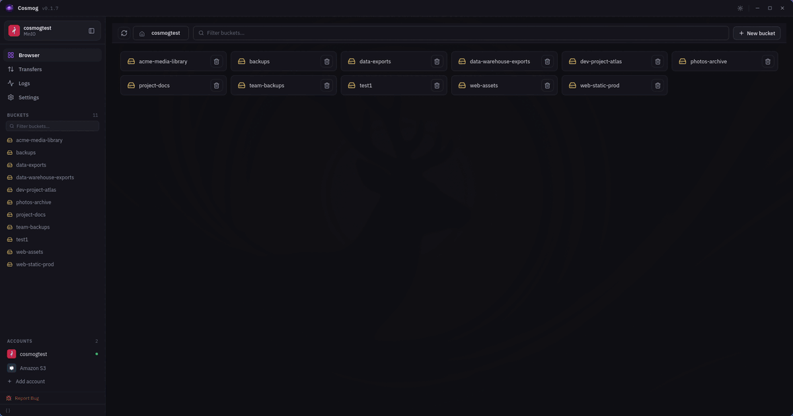

<div align="center">
  

  # Cosmog

  Your S3 storage, everywhere.  
  A fast, native app for managing files across any S3-compatible provider on desktop and android.

  [Download latest release →](https://github.com/echosonusharma/cosmog/releases/latest)

</div>

> **Early development.** Cosmog is actively being built, you may encounter bugs.
> If something breaks, [open an issue](https://github.com/echosonusharma/cosmog/issues) and we'll fix it.

<div align="center">



</div>

---

## What you can do

- 🗂️ **Browse** buckets and folders with fast column navigation
- 📤 **Upload and download** with a background queue, progress tracking, and retry
- 👁️ **Preview** images, PDFs, spreadsheets, JSON, XML, text, and code without downloading
- ✏️ **Edit** text based files (md, json, txt, and more) & spreadsheets directly in the app
- 🔍 **Search** across your entire bucket with full-text search
- 🔗 **Share** files instantly with presigned links
- 🔒 **Encrypt** entire buckets client-side with per-bucket keys
- 👤 **Manage** multiple accounts and providers side by side

## Why Cosmog

| | Cosmog | S3 Browser | Cyberduck | Transmit 5 |
|---|:---:|:---:|:---:|:---:|
| macOS | ✅ | ❌ | ✅ | ✅ |
| Windows | ✅ | ✅ | ✅ | ❌ |
| Linux | ✅ | ❌ | ❌ | ❌ |
| **Android** | ✅ | ❌ | ❌ | ❌ |
| Free & open source | ✅ | Personal only | Donationware | ❌ Paid |
| Full-text search | ✅ | ❌ | ❌ | ❌ |
| Client-side encryption | ✅ | ❌ | ✅ (Cryptomator) | ❌ |
| In-app file preview | ✅ | ❌ | ❌ | Limited |
| In-app editor | ✅ | ❌ | ❌ | ❌ |
| Multiple accounts | ✅ | ✅ | ✅ | ✅ |

## Works with your provider

AWS S3, Cloudflare R2, Backblaze B2, DigitalOcean Spaces, Wasabi, MinIO, and any S3-compatible API.

## Download

| Platform | Link | File to download |
|---|---|---|
| macOS (Apple Silicon) | [Download](https://github.com/echosonusharma/cosmog/releases/latest) | `Cosmog_*_aarch64.dmg` |
| macOS (Intel) | [Download](https://github.com/echosonusharma/cosmog/releases/latest) | `Cosmog_*_x64.dmg` |
| Windows | [Download](https://github.com/echosonusharma/cosmog/releases/latest) | `Cosmog_*_x64-setup.exe` or `.msi` |
| Linux (AppImage) | [Download](https://github.com/echosonusharma/cosmog/releases/latest) | `Cosmog_*_amd64.AppImage` |
| Linux (deb) | [Download](https://github.com/echosonusharma/cosmog/releases/latest) | `Cosmog_*_amd64.deb` |
| Linux (rpm) | [Download](https://github.com/echosonusharma/cosmog/releases/latest) | `Cosmog-*-1.x86_64.rpm` |
| Android (requires 7.0+) | [Download](https://github.com/echosonusharma/cosmog/releases/latest) | `Cosmog-*-android-arm64.apk` (most phones) |

Credentials are stored in the native OS secret store on each platform and never written to disk.

## Development

Requires [Rust](https://rustup.rs) and Node 22+.

```sh
npm install
npm run tauri dev    # desktop, hot reload
npm run tauri build  # desktop, production
```

For Android setup and internals, see [DOCS.md](DOCS.md).
