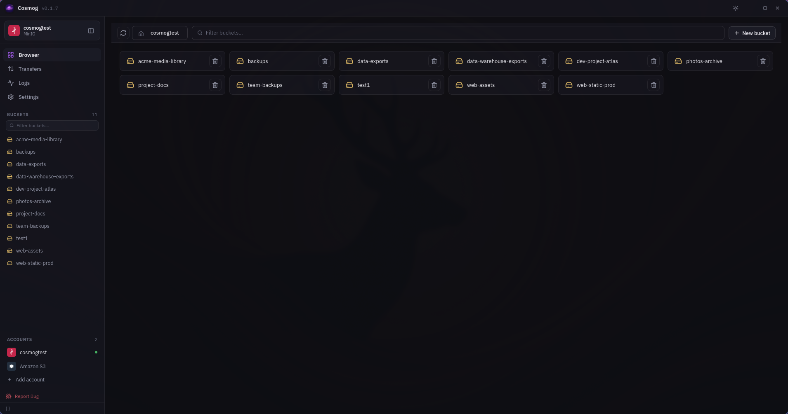
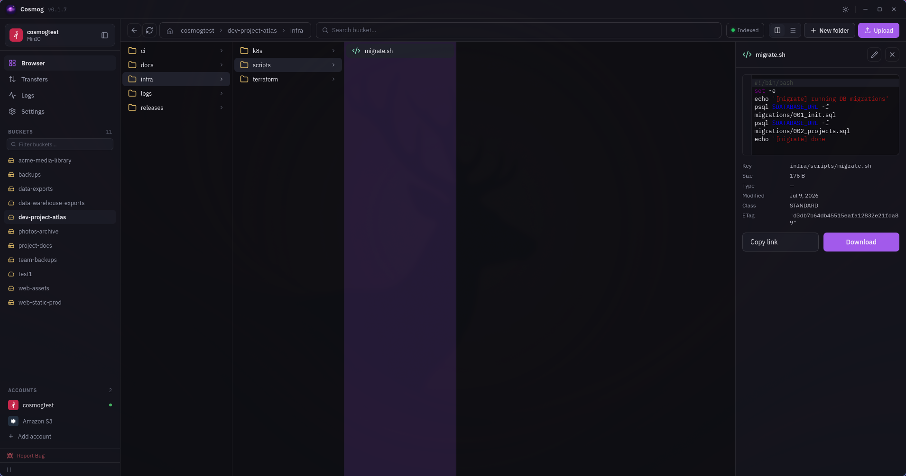
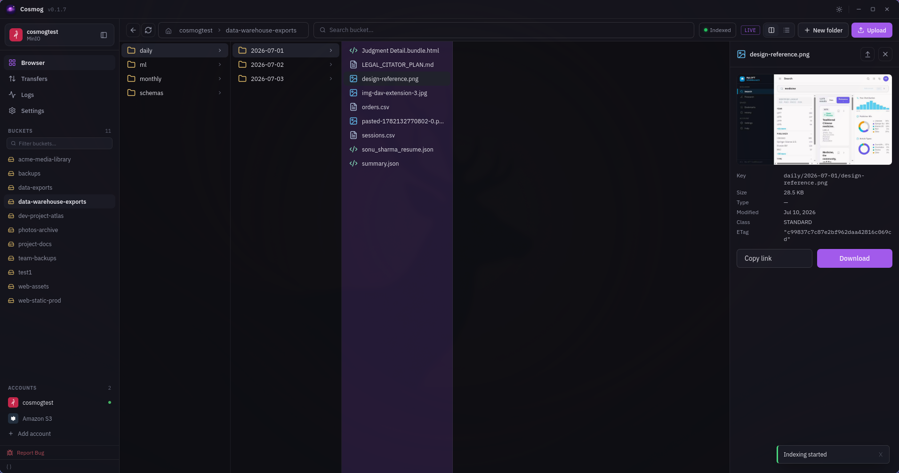
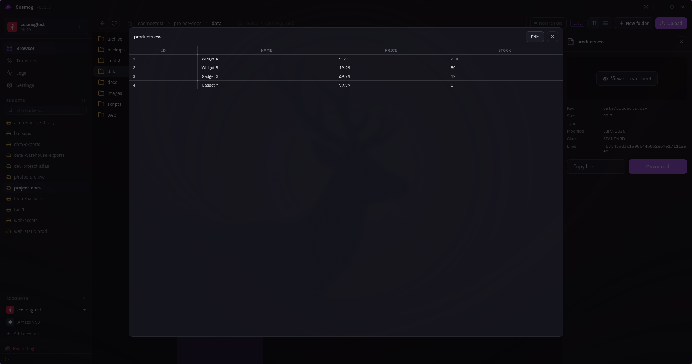
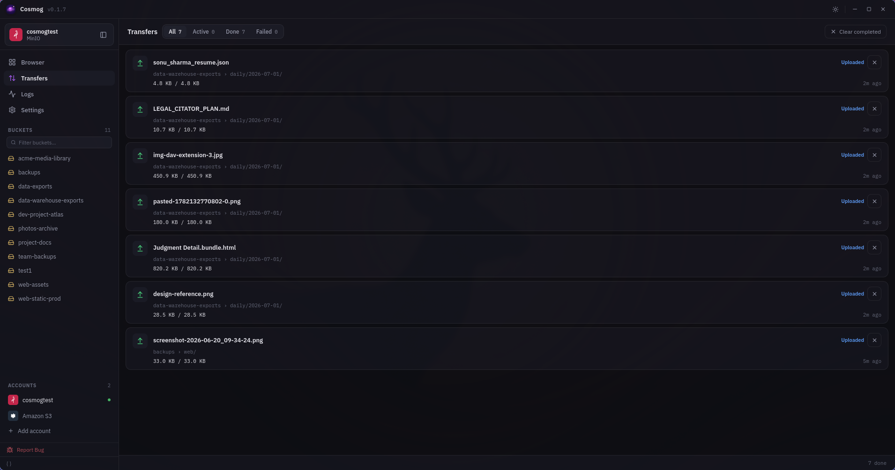
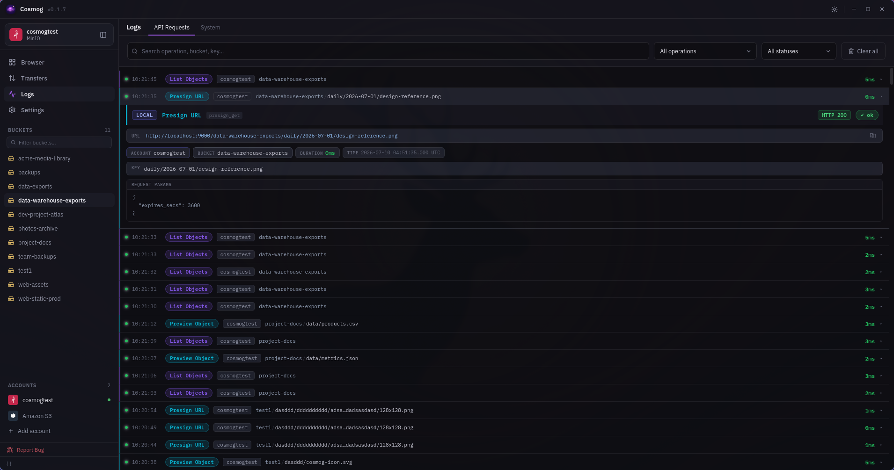

<div align="center">
  

  # Cosmog

  Desktop app for managing S3-compatible object storage.  
  Browse, upload, download, and organize files across any S3 provider.
</div>

## Screenshots

<div align="center">


*Bucket browser*


*Column view + file preview*


*Image preview*


*Spreadsheet preview*


*Transfer manager*


*Request logs*

</div>

## Features

- **Browse** buckets and objects with folder navigation, column layout, and search
- **Upload and download** files with background transfer queue, progress tracking, and retry
- **Preview** images, text, JSON, XML, and spreadsheets inline
- **Edit** text files directly in the app
- **Bulk operations** including multi-select delete and presigned link generation
- **Create and delete** buckets, folders, and objects
- **Copy and move** objects within and across buckets
- **Presigned URLs** with configurable expiry
- **Versioning** view and toggle bucket versioning
- **Full-text search** with local index per bucket
- **Multiple accounts** manage credentials for many providers side by side
- **Transfer manager** real-time speed, filter by active, done, or failed
- **Request logs** searchable history of every S3 API call with operation and status filters
- **System logs** live-tailing log viewer with level filter and search
- **Multi-region routing** buckets are automatically routed to their correct AWS region
- **Secure credentials** secrets stored in the OS keychain, never written to disk
- **Backup and restore** export and import accounts and settings as JSON (secrets excluded)
- **Themes** light, dark, or follow system

## Supported Providers

| Provider | Notes |
|---|---|
| Amazon S3 | Native AWS support |
| Cloudflare R2 | Custom endpoint required |
| Backblaze B2 | Custom endpoint required |
| DigitalOcean Spaces | Custom endpoint required |
| Wasabi | Custom endpoint required |
| MinIO | Self-hosted |
| Any S3-compatible API | Works with any provider matching the AWS S3 API |

## Download

| Platform | |
|---|---|
| macOS (Apple Silicon) | [Download](https://github.com/echosonusharma/cosmog/releases/latest) |
| macOS (Intel) | [Download](https://github.com/echosonusharma/cosmog/releases/latest) |
| Windows | [Download](https://github.com/echosonusharma/cosmog/releases/latest) |
| Linux (AppImage) | [Download](https://github.com/echosonusharma/cosmog/releases/latest) |
| Linux (.deb) | [Download](https://github.com/echosonusharma/cosmog/releases/latest) |

> Credentials are stored in the native OS secret store: Keychain on macOS,
> Credential Manager on Windows, and the D-Bus Secret Service on Linux.
> A compatible provider such as GNOME Keyring, KWallet, or KeePassXC must be running on Linux.

## Development

**Prerequisites**
- [Rust](https://rustup.rs) (stable toolchain)
- Node 22+
- Linux only: `sudo apt install libwebkit2gtk-4.1-dev libgtk-3-dev libayatana-appindicator3-dev librsvg2-dev`

```sh
npm install
npm run tauri dev     # run with hot reload
npm run tauri build   # production bundles
```

Architecture, module layout, and internals are documented in [DOCS.md](DOCS.md).
